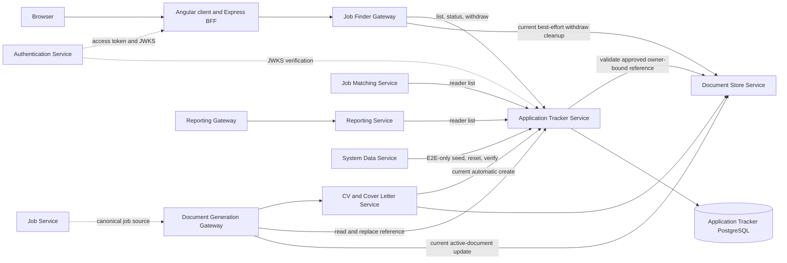

# Application Tracking architecture and ownership

Status: **Accepted architecture decision for private-beta delivery**  
Decision date: 2026-07-26  
Scope owner: `jobseekercopilot/application-tracker-service`  
Delivery status: the decision is approved; the linked implementation issues
remain authoritative for unfinished work.

## Decision

Application Tracker is the sole authority for an application record, its owner
binding, current lifecycle state, optimistic version, application activity
history and the exact document versions selected or frozen for that
application.

Application Tracker does not own authentication identities, jobs or document
content:

- Authentication Service owns the user subject and access-token lifecycle.
- Job Service owns canonical and provider job identity and the current job
  representation. Application Tracker stores an immutable application snapshot
  and stable job identifiers, not a second editable job.
- Document Store owns document content, approval state, family/version
  identity, hashes, retention and deletion. Application Tracker stores
  owner-validated references and the immutable versions used for an
  application.
- Reporting and Job Matching own derived read models only. They cannot mutate
  or reinterpret Application Tracker facts.

The durable application workflow belongs with Application Tracker. Edge
gateways may authenticate, validate and proxy a command, but they must not
become the only place that remembers a cross-service step or performs
best-effort cleanup after Application Tracker has committed.

Generation and tracking are separate workflows. Creating documents does not,
by itself, create an application. A user-approved or otherwise explicit,
idempotent application command creates the record. This resolves the target
boundary for APP-05 and CVCL-01 without implementing either issue here.

## Source-backed current flow

The following diagram records the current source, including known transitional
behavior. A solid arrow is a runtime call; a dotted arrow supplies identity or
authoritative source data.

### Evidence ledger

| Component | Current source evidence | Observed responsibility |
| --- | --- | --- |
| Application Tracker | `ApplicationRecordController`, `ApplicationRecordService`, `ApplicationRecord`, `ApplicationSecurityConfig` | Owns the row, owner-scoped queries, lifecycle transition, record version and current/frozen document references. |
| CV and Cover Letter Service | `CvCoverLetterService.generate` and `createApplication` | Saves two documents and currently creates a `DOCUMENTS_GENERATED` application before billing commit. CVCL-01 owns removal of that coupling. |
| Document Generation Gateway | `DocumentGenerationService.fetchApplication`, `validateApplicationAllowsDocumentReplacement` and replacement flow | Reads application state and currently updates Document Store before updating the application reference. APP-08 and DOCGEN-17 own the recoverable target. |
| Job Finder Gateway | `JobSearchController` application list/status/withdraw endpoints | Delegates the user Bearer token and validates returned ownership. It currently deletes documents after Tracker has deleted a generated record. |
| Job Matching Service | `ApplicationTrackerClient` and `JobMatchingService` | Reads owner-scoped application rows and derives ephemeral job-card enrichment. |
| Reporting Service | `ReportingService.applicationsFor`, `applicationSummary` and `timeline` | Reads owner-scoped rows and currently infers one activity from each mutable row. REPORT-04/06 own historical reporting delivery. |
| Angular client and Express BFF | `application-tracker.service.ts` and `server.ts` | Calls Job Finder routes; the compatibility `/api/v1/applications` BFF route still proxies Job Finder rather than Tracker directly. The client currently synthesizes timeline events. |
| System Data Service | `EnvironmentOrchestrationService` and application seed DTOs | Coordinates deterministic E2E-only scenario seed, reset and verification through the dedicated internal contract. |
| Document Store | Tracker `HttpDocumentReferenceVerifier` plus Document Generation document calls | Owns content/version/approval/retention facts. Tracker verifies references before accepting them. |
| PostgreSQL | Flyway migrations, `ApplicationRecordRepository` and `DATABASE_OPERATIONS.md` | Durable application persistence; production managed-service and restore evidence remain Infrastructure work. |

## Authoritative data ownership

| Datum | Authoritative owner | Application Tracker representation and rule |
| --- | --- | --- |
| User subject and account lifecycle | Authentication Service | Stores the immutable subject value as `userId`; never accepts a caller-selected owner as authority. |
| Canonical job ID, provider/external identity and live job data | Job Service | Stores stable IDs and an application-time title/company/location snapshot. Legacy fallbacks are not a second job authority. |
| Application ID and owner binding | Application Tracker | Generated and persisted once. All record access includes the authenticated owner boundary. |
| Current application lifecycle state | Application Tracker | Enforces the approved transition matrix and optimistic version. Consumers display but do not remap or override it. |
| Application activity history and milestone times | Application Tracker | Append-only events hold actual and recorded times; `updatedAt` is not history and must not be presented as one. |
| Current application document selection | Application Tracker | Stores an owner-validated Document Store version reference while the record is editable. |
| Document version used for an application | Application Tracker | Atomically freezes the exact IDs, families, versions and hashes when the application first progresses. |
| Document content, type, approval, family/version, hash and retention | Document Store | Tracker references and validates these facts; it never stores content. |
| Document-to-application reverse index or retention pin | Document Store | A projection derived from an accepted Tracker command. It is not allowed to contradict Tracker application state. |
| Match/enrichment result | Job Matching | Ephemeral derivation of Job Service facts plus Tracker state. Only stable canonical or provider/external identity is authoritative. |
| Report metrics and journal text | Reporting | Derived from versioned Tracker current-state and event queries. Reporting does not manufacture missing events. |
| E2E scenario definition | System Data | Tracker owns the persisted fixture rows inside the explicit owner/scenario boundary. Fixtures are never a production write path. |

No service may update another owner's datum through a local copy. Cross-domain
data is a validated reference, immutable snapshot, versioned event or
rebuildable projection.

## Command and query ownership

| Operation | Accepted authority and entry | Durable command owner | Required behavior |
| --- | --- | --- | --- |
| Create application | Explicit user-delegated workflow, or an approved producer acting for a trusted inbound subject | Application Tracker | Idempotent independently of generation; validate canonical job snapshot and both approved document references; return the same outcome after a lost response. |
| List/get application | Bearer subject, or approved reader/producer with authenticated owner context | Application Tracker query model | Owner-scoped, non-enumerating and eventually paginated. |
| Update status | Bearer subject through Job Finder | Application Tracker | Validate transition and expected version; atomically freeze application-used documents; append one event. |
| Replace current document | Bearer-delegated Document Generation workflow or approved producer | Application Tracker | Allowed only before freeze; validate the new Store reference; persist a durable outcome before updating projections. |
| Withdraw generated-only record | Bearer subject through Job Finder | Application Tracker workflow | Record an idempotent durable outcome and coordinate Store cleanup recoverably; the gateway cannot silently swallow cleanup failure. |
| Archive/delete | Bearer subject under approved retention policy | Application Tracker for the application; Document Store for content | Produce archive/tombstone and retention outcomes before physical removal. Submitted history is never hard-deleted ad hoc. |
| Read for matching | Dedicated Job Matching reader acting on a trusted owner | Application Tracker | Return immutable owner-scoped facts; outage produces explicit unknown/degraded state, not false `NEW`. |
| Read for reporting | Dedicated Reporting reader acting on a validated report owner | Application Tracker | Separate current-state queries from append-only event/range queries. |
| Seed/reset/verify fixture | E2E-only System Data identity and enabled profile | Application Tracker fixture boundary | Owner-and-scenario scoped, deterministic and disabled in every production-like mode. |

## Trust boundaries

| Caller | Authentication at Tracker | Owner authority | Allowed boundary |
| --- | --- | --- | --- |
| Browser through BFF and Job Finder | RS256 access token with issuer, audience, expiry, `token_type=access` and nonblank `sub` | JWT `sub` only | Own application commands and queries. Browser `X-User-Id`, body or path values never grant ownership. |
| CV/Cover Letter producer | Distinct producer identity injected at runtime | Trusted inbound subject forwarded as explicit owner context | Explicit idempotent create only; no status, withdraw or delete. Automatic create is transitional and removed by CVCL-01. |
| Document Generation producer | Its own distinct producer identity | Trusted inbound subject forwarded as explicit owner context | Owner-scoped reads and pre-freeze reference commands only. |
| Job Matching reader | Distinct read-only identity | Owner established by the authenticated upstream request | Owner-scoped read model only. |
| Reporting reader | Distinct read-only identity | Owner validated by Reporting Gateway from the user access token | Owner-scoped current/event reads only. |
| System Data | Independent environment-data identity plus exact E2E enablement | Versioned fixture envelope | Internal seed/reset/verify paths only. |
| Tracker to Document Store | Dedicated least-privilege Store reader identity | Same already-authenticated application owner | Reference validation only. |

The current role-class producer and reader secrets are a transitional
implementation. APP-03 and INFRA-08 own distinct per-caller production
identities, injection, rotation and revocation. This decision does not place
credential values in contracts, logs or repositories.

## Flow and failure ownership

| Flow | Transaction or durable commit point | Failure owner and truthful outcome | Delivery issue |
| --- | --- | --- | --- |
| Generate draft documents | CV/Cover Letter generation operation | Generation owns provider, billing reservation and draft saves. No Tracker row is created merely because generation succeeded. Partial work is resumed or compensated by operation key. | CVCL-01, CVCL-02 |
| Create application | Tracker idempotency key plus application transaction | Reference validation failure creates no row. A database failure creates no row. A lost success response is safely replayed. | APP-05, DOCGEN-17 |
| Replace selected document | Tracker reference command and outbox/workflow state | Store unavailability rejects before commit; projection/retention failure remains visible and retryable after commit. The caller never reports full success after only one side changed. | APP-08, DOCGEN-17 |
| Change lifecycle state | Tracker database transaction | Invalid/stale/concurrent commands return stable `409`; successful state, frozen references and event are atomic. | APP-06, APP-07 |
| Withdraw generated-only application | Tracker durable workflow/tombstone | Document cleanup is idempotent and retryable. The response distinguishes accepted/pending from fully completed cleanup. | APP-08, APP-09 |
| Archive/delete submitted application | Tracker retention decision plus Store retention outcome | Legal/product retention rules can refuse or defer physical deletion; audit history and dependency state remain reconcilable. | APP-09 |
| Match job results | No durable write; derived response | Tracker timeout/unavailability returns explicit degradation. Ambiguous title/company/location similarity cannot assert an application match. | MATCH-03/04/05/07/08 |
| Produce report or timeline | No application write; derived response | Missing current/event sources produce an unavailable or explicitly partial report, never invented activity. | REPORT-03/04/06 |
| Seed/reset E2E scenario | Per-service idempotent fixture operation | System Data fails the named-state workflow visibly and can retry/reset the same owner/scenario boundary. No production data path is opened. | APP-11, E2E |

APP-08 chooses and implements the concrete outbox/workflow mechanism. The
decision here is limited to ownership and failure semantics.

## Contract and test boundaries

| Layer | Owning verification |
| --- | --- |
| Application domain unit tests | Tracker lifecycle, idempotent create/status/withdraw, frozen references, archive policy, event ordering and owner predicates. |
| Producer API contract | Tracker generates and semantically drift-checks OpenAPI. Consumers pin the exact producer revision/checksum and test documented success plus `400/401/403/404/409/503` failures. APP-02 and INFRA-07 own publication. |
| Security integration | Tracker proves forged/expired/wrong-issuer/wrong-audience tokens, caller-role matrix, missing/foreign owner context and non-enumerating denials. Each consumer proves it cannot choose another owner. |
| Persistence integration | Real PostgreSQL migrations, restart persistence, concurrent commands, unique idempotency, outbox/event atomicity, backup and restore. H2 is not production evidence. |
| Cross-service integration | Deterministic fixtures cover Store reference eligibility, create replay, replacement failure after each boundary, cleanup retry, Matching degradation and Reporting current-versus-history semantics. No live provider, LLM, Stripe, AWS or paid service is required. |
| Browser E2E | Browser → BFF → Job Finder → Tracker journeys cover create/track, status conflict, replacement, withdraw/archive, cross-user denial, timeline truthfulness and dependency outages. Tests must assert outcomes rather than wait and continue. |

## Dependency coordination

| Existing issue | APP-01 coordination decision | Scope that remains there |
| --- | --- | --- |
| APP-02 | Tracker owns the producer contract. | Package publication, consumer pins and compatibility gates. |
| APP-03 / INFRA-08 | Identity classes are approved; production callers need distinct credentials and owner propagation. | Consumer rollout, secret injection, rotation and revocation. |
| APP-04 | PostgreSQL is the application system of record. | Managed deployment, encryption, backup and restore evidence. |
| APP-05 | Creation is explicit, generation-independent and idempotent. | Request identity, uniqueness, manual/external capture and implementation. |
| APP-06 / APP-07 | Tracker owns lifecycle and append-only history. | Existing transition rollout plus event schema/storage/reopen rules. |
| APP-08 / APP-09 | Tracker owns durable workflow/application retention; Store owns content retention. | Outbox/recovery/reconciliation and approved archive/delete policy. |
| APP-10 / APP-14 / APP-17 | Tracker owns scalable owner queries and final evidence. | Pagination/indexing, test consolidation and private-beta validation. |
| APP-15 and E2E | Client displays Tracker facts and uses Job Finder as the user command boundary. | Accessible UX and deterministic browser evidence. |
| CVCL-01 / CVCL-02 | Generation no longer implies application creation. | Draft/approval/billing recovery and contract rollout. |
| DOCGEN-17 | Document Generation is an adapter, not an application authority. | Canonical job resolution and recoverable create/reference integration. |
| JFG-01 | Job Finder delegates Bearer identity and does not own state. | Completed owner proxy evidence is retained; APP-08 removes edge-only cleanup ownership. |
| MATCH-02 through MATCH-08 | Matching consumes a read model and cannot create application facts. | Contract rollout, authenticated caller, stable identity, ambiguity rejection and truthful degradation. |
| REPORT-03/04/06 | Reporting consumes current and historical Tracker facts separately. | Authenticated reader, event source, status mapping and known-answer reports. |

This record does not close or duplicate those issues. It supplies the ownership
decision they consume.

## Consequences and non-goals

- Application Tracker becomes a clear domain service rather than a passive row
  store behind edge orchestration.
- Existing automatic creation, dual writes, best-effort cleanup, fuzzy matching
  and synthesized timelines are explicitly transitional and cannot be treated
  as beta-ready evidence.
- Cross-service operations may be eventually completed, but their accepted,
  pending, failed and reconciled states must be durable and truthful.
- No AWS resource, paid provider, live LLM, Stripe call or deployment is
  authorized by this decision.
- APP-01 changes architecture and documentation only. It does not implement
  any linked feature or backlog opportunity.
