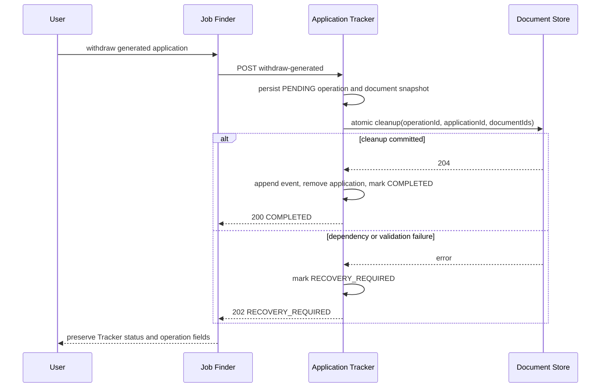
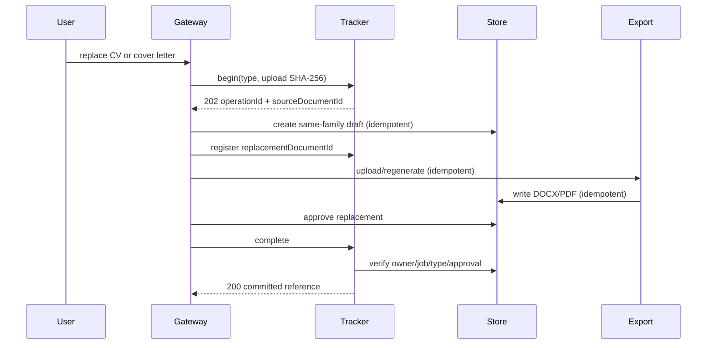

# Recoverable application document workflows

Application Tracker owns the durable outcome of cross-service application
commands. APP-08 now delivers generated-only withdrawal and document
replacement. Broader reconciliation of pre-existing application/document-link
mismatches remains tracked by APP-08 and DOCGEN-17.

## Generated withdrawal

`POST /api/v1/applications/{id}/withdraw-generated` accepts an owner-scoped
command only while the application is `DOCUMENTS_GENERATED`. Tracker snapshots
the selected document IDs and records one stable operation ID before calling
Document Store. A repeated request for the same owner and application loads the
same workflow.

Tracker asks Document Store to soft-delete only document versions that are not
referenced by another application for that owner. Document Store processes the
complete list atomically and records the operation ID, so a lost response can
be replayed without duplicating lifecycle events. Tracker deletes the generated
application only after that command succeeds. Until then, the application
remains visible and status, document-reference and deletion commands are
rejected.

## State and response contract

| State | Meaning | HTTP result |
| --- | --- | --- |
| `PENDING` | The operation is durable but cleanup has not been claimed | `202` |
| `RUNNING` | A caller or recovery worker claimed an attempt | `202` if observed |
| `RECOVERY_REQUIRED` | Cleanup failed; `retryable` and `recoveryCode` explain the next action | `202` |
| `COMPLETED` | Document cleanup succeeded and the generated application was removed | `200` |

The response includes `operationId`, `operationStatus`, `retryable`,
`recoveryCode` and `completedAt`, while retaining the existing
`applicationId`, `status`, `withdrawn` and `message` fields. The same state is
available from `GET /api/v1/applications/{id}/withdraw-generated`.

Transient Store failures use `DOCUMENT_STORE_UNAVAILABLE` and are retried by a
bounded scheduled worker. A rejected cleanup, malformed stored reference or
Tracker state mismatch is non-retryable and remains visible for reviewed
repair. The worker processes at most 50 oldest retryable workflows per pass.

## Operational recovery

1. Query the owner-scoped status endpoint and record the operation status and
   recovery code. Do not log owner or document identifiers.
2. For `DOCUMENT_STORE_UNAVAILABLE`, restore the dependency and either replay
   the original POST or allow the scheduled worker to retry the same operation.
3. For a non-retryable code, inspect Tracker and Store audit evidence before a
   narrowly reviewed repair. Do not delete the application or documents by
   hand to make the status disappear.
4. Confirm `COMPLETED`, the withdrawal activity event and the absence of the
   generated application. Document Store must show at most one soft-delete
   event per cleaned document with the operation ID as its case reference.

## Verification boundary

Local integration tests prove failure-before-cleanup, visible pending state,
blocked concurrent application mutation, same-operation replay, atomic
two-document cleanup, rollback when any document is missing, owner isolation,
changed-payload rejection and completed replay without duplicate lifecycle
events. PostgreSQL migration tests prove that workflow state survives restart.
No AWS resource, paid provider or GitHub Actions execution is required for this
evidence.

## Document replacement

`POST /api/v1/applications/{id}/document-replacements` reserves a durable
Tracker operation before the Gateway creates a replacement document. The
request contains the document type and the SHA-256 of the validated upload.
Replaying the same bytes returns the same operation; a different request is
rejected while the application is locked.

The Gateway then:

1. creates the replacement in the same Store document family using
   `Idempotency-Key: {operationId}:document`;
2. registers the exact replacement document with Tracker;
3. sends the stable operation key to Document Export so DOCX and PDF writes
   are replay-safe;
4. approves the completed Store document; and
5. asks Tracker to verify and atomically commit the new immutable reference.

Tracker is the only component that changes the application reference. The old
approved reference remains visible until the final commit. Status changes and
other document mutations are rejected while a replacement is active.

If a downstream step fails after `begin`, the Gateway records
`RECOVERY_REQUIRED` and returns `202` with the operation ID, retryability and a
stable recovery code. It does not claim that the application reference changed.
Retrying the same file resumes the operation. A scheduled Tracker reconciler
also completes a registered replacement once Store reports it as approved,
covering a lost final response.

### Replacement recovery

1. Read `GET /api/v1/applications/{id}/document-replacements/{operationId}`.
2. Confirm the application still points at `sourceDocumentId`.
3. If `retryable=true`, replay the original validated upload through the
   Gateway. Do not manufacture a new operation ID.
4. If a registered replacement is already approved, allow the reconciler or
   call the producer-only `.../{operationId}/complete` command.
5. Escalate `APPLICATION_STATE_MISMATCH` for operator review; it is deliberately
   non-retryable because another mutation changed the locked state.

Do not delete the source document during replacement recovery. Retention and
historical-version policy remain separate work.
